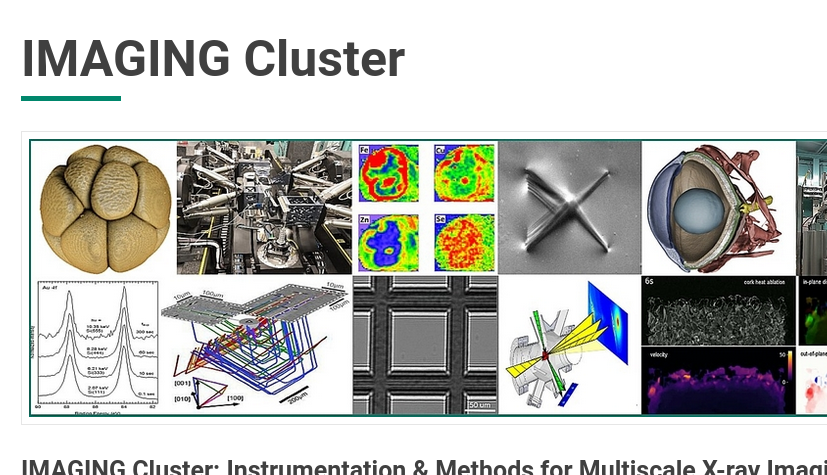

# Scientific context

## Motivation

# The beginnings

## Electrostatics

---

::: {.theorem}
**Coloumb's law** showed experimentally that
$$
\vec{F} =  \frac{k q_1 q_2}{|x_1 - x_2|^3} (\vec{x_1} - \vec{x_2})
$$
TODO: add notes
:::

---

Experimentally, superposition has been shown to be valid for electric fields.
$$
E (\vec{x}) = \frac{1}{4 \pi \epsilon_0} \int_V \rho (\vec{x}) \frac{\vec{x} - \vec{x'}}{|\vec{x} - \vec{x'}|^3} d\vec{x'}
$$
with $\rho(\vec{x}) = \sum q_i \delta (\vec{x} - \vec{x_i})$.

---

::: { #interactive }
:::

---

The flux of the electric field is defined as [TODO]:
$$
\Phi_E = \int_S \vec{E} \cdot \mathrm{dA}
$$

---
::: {.theorem}
**Gauss's law** is derived from the assuption that the emanating field of a charge is spherical.
$$
\oint_V \vec{E} \cdot \vec{n} \mathrm{d}a = \frac{q_1}{\epsilon_0}
$$
TODO: add notes
:::

---

By applying the [Divergen theorem]{.keyword} to Gauss's law, we can show that
$$
\vec{\nabla} \cdot \vec{E}(\vec{x}) = \frac{\rho(\vec{x})}{\epsilon_0}
$$
TODO: add name

## Magnetostatics

TODO

## From micro to macro

TODO : tedious, but interesting

## Wrap-up

TODO : wrap up of maxwell's static equations

# From static to dynamic

TODO : add nice dynamic plot

## Maxwell's equations

---

$$
\begin{cases}
\nabla \cdot \vec{D} = \rho \\
\nabla \cdot \vec{B} = 0 \\
\nabla \times \vec{E} = -\frac{\partial \vec{B}}{\partial t} \\
\nabla \times \vec{H} = \vec{J} + \frac{\partial \vec{D}}{\partial t}
\end{cases}
$$

---

Simplification : No current density $\vec{J} = 0$

Simplification : linear, homogeneous materials => $\vec{D} = \epsilon \vec{E}$ and $\vec{H} = \frac{1}{\mu} \vec{B}$

Simplification : material is vaccum ~ air => $\epsilon = \epsilon_0$ and $\mu = \mu_0$

# The wave equation

## Algebraic derivation

TODO : derive the 3d wave equation algebraically, no electromagnetic field required

## Wait, electromagnetic radiation is a wave?

